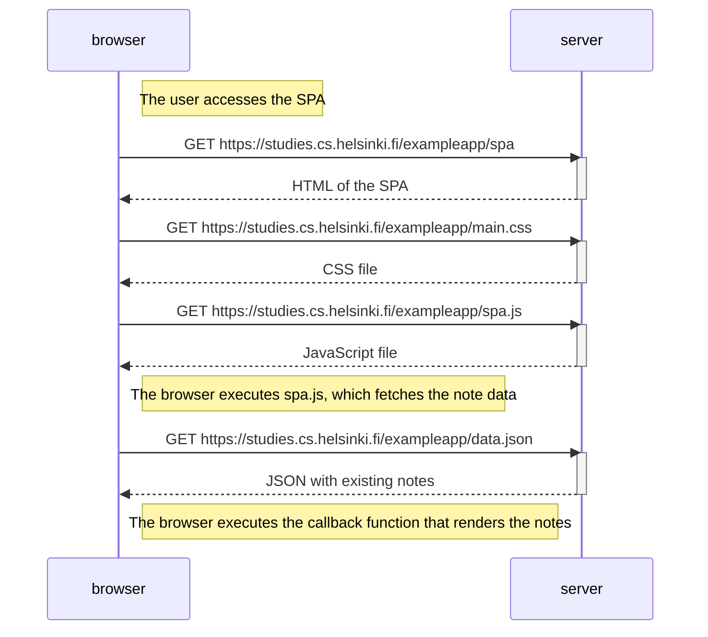

```mermaid
sequenceDiagram
    participant browser
    participant server

    Note right of browser: The user accesses the SPA

    browser->>server: GET https://studies.cs.helsinki.fi/exampleapp/spa
    activate server
    server-->>browser: HTML of the SPA
    deactivate server

    browser->>server: GET https://studies.cs.helsinki.fi/exampleapp/main.css
    activate server
    server-->>browser: CSS file
    deactivate server

    browser->>server: GET https://studies.cs.helsinki.fi/exampleapp/spa.js
    activate server
    server-->>browser: JavaScript file
    deactivate server

    Note right of browser: The browser executes spa.js, which fetches the note data

    browser->>server: GET https://studies.cs.helsinki.fi/exampleapp/data.json
    activate server
    server-->>browser: JSON with existing notes
    deactivate server

    Note right of browser: The browser executes the callback function that renders the notes

```